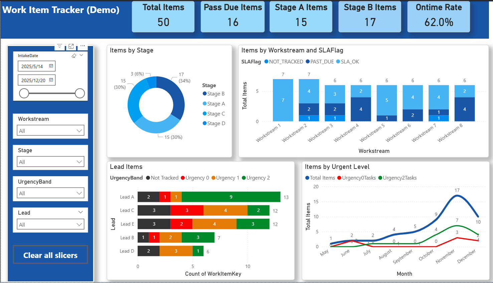
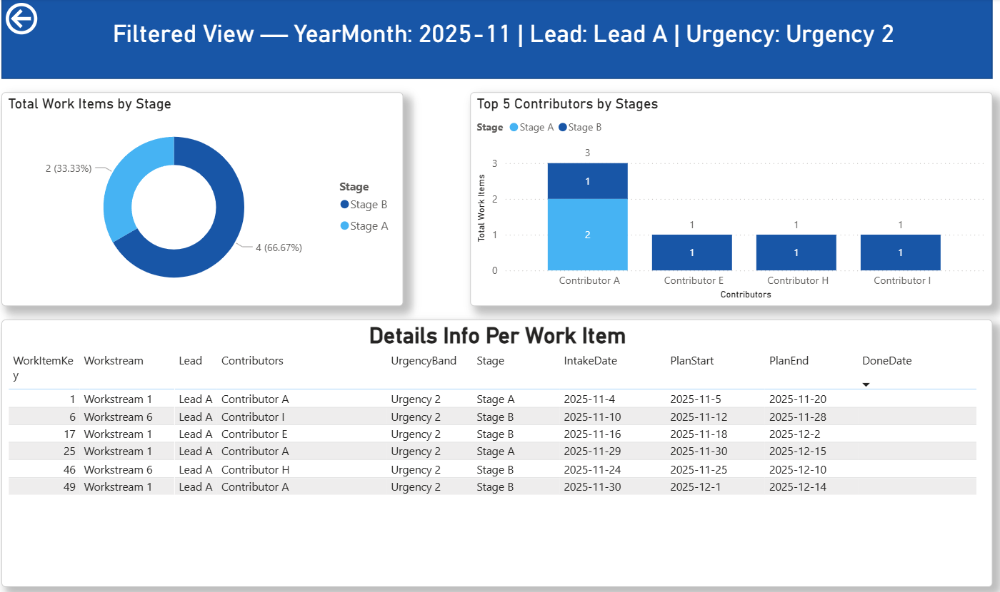
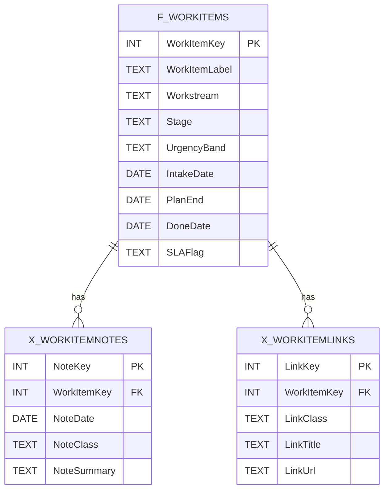

# Work Item Tracker Analytics (Fabric + Power BI) — Demo / Redacted

End-to-end operational analytics pipeline:  
**SharePoint (parent/child lists) → Fabric Dataflow Gen2 → Lakehouse → Semantic Model → Power BI Report (drill-through)**

This repository is a **public demo**:
- Uses **synthetic data** in `sample-data/`
- Uses **pseudonymous naming** (e.g., `WorkItemKey`, `LeadAlias`, `Workstream`, `Stage`)
- Includes **redacted visuals** (no tenant URLs, no real names, no internal identifiers)
## Report Screenshots (Redacted Demo)

### Drill-through Demo(Lead)

---

## What this demonstrates
- Modeling **parent/child list data** for analytics (work items + notes/links)
- Building an **ETL pipeline** in Fabric Dataflow Gen2 (Power Query M)
- Publishing an analytics-ready table in a **Lakehouse**, then creating a **semantic model**
- Designing a **Power BI report** with KPI cards, trends, and drill-through patterns

---

## Architecture (Demo)

### Fabric lineage (v2)

**Flow summary**
1) Two SharePoint sources (parent + child)
2) Two Dataflow Gen2 pipelines standardize and enrich data
3) Lakehouse stores curated tables
4) Semantic model provides KPI measures and time intelligence
5) Power BI report supports slice/filter + drill-through detail

Implementation details: [`docs/architecture.md`](docs/architecture.md)

---

## Data Model (Demo)

**Grain:** `f_WorkItems` is modeled at the **work item grain** (1 row per `WorkItemKey`).  
Child tables store detail at **many-to-one** (notes/links).

- Full schema details: [`docs/schema.md`](docs/schema.md)

---

## Demo Data
Synthetic CSV samples live in:
- [`sample-data/f_WorkItems_demo.csv`](sample-data/f_WorkItems_demo.csv)
- [`sample-data/x_WorkItemNotes_demo.csv`](sample-data/x_WorkItemNotes_demo.csv)
- [`sample-data/x_WorkItemLinks_demo.csv`](sample-data/x_WorkItemLinks_demo.csv)

These files contain **no production values** and are designed only to showcase the pipeline patterns.

---

## Power Query (ETL)
Public-safe M examples:
- [`powerquery/df_workitems_demo.m`](powerquery/df_workitems_demo.m)
- [`powerquery/df_notes_demo.m`](powerquery/df_notes_demo.m)

Key transformations include:
- type standardization (dates/enums)
- flattening multi-person fields into delimited text
- derived flags (e.g., `SLAFlag`)
- aggregation of child notes into work-item level (optional)

---

## Semantic Layer (DAX)
Demo measures are documented here:
- [`dax/measures_demo.md`](dax/measures_demo.md)

Example KPI categories:
- volume: total items / active / done
- SLA: eligible vs past due / SLA OK rate
- trend helpers: MTD / YTD (requires `d_Calendar`)

---

## How to use this repo

### Option A — Quick review (recommended)
1) Open the lineage image: [`screenshots/fabric/lineage_v2_demo.png`](screenshots/fabric/lineage_v2_demo.png)
2) Read the data model: [`docs/schema.md`](docs/schema.md)
3) Scan ETL patterns: [`powerquery/`](powerquery/)
4) Scan measures: [`dax/measures_demo.md`](dax/measures_demo.md)

### Option B — Rebuild with your own demo data
1) Replace CSVs in `sample-data/` with your own synthetic values
2) Update the Power Query file(s) to point to your raw URLs or local files
3) Recreate the semantic model and measures in Power BI

---

## Security & Privacy (Public-safe)
- No tenant URLs, list GUIDs, workspace names, real user names/emails, or record-level descriptions
- Visuals are redacted and naming is intentionally different from any internal environment
- This repo is for portfolio demonstration only

Details: [`docs/security-and-privacy.md`](docs/security-and-privacy.md)

---

## Project Status
See: [`docs/project-status.md`](docs/project-status.md)

---

## Repo Map
- [`docs/quickstart.md`](docs/quickstart.md) – rebuild steps and how to review the demo (optional)
- [`docs/architecture.md`](docs/architecture.md) – pipeline overview & Fabric lineage (v2)
- [`docs/schema.md`](docs/schema.md) – parent/child schema + ER diagram (redacted)
- [`docs/data-dictionary.md`](docs/data-dictionary.md) – field definitions + KPI dependencies (demo)
- [`docs/kpi-spec.md`](docs/kpi-spec.md) – KPI definitions and business rules (optional)
- [`docs/security-and-privacy.md`](docs/security-and-privacy.md) – redaction rules / public-safe policy (optional)
- [`docs/model.md`](docs/model.md) – semantic model notes (grain, relationships, date assumptions)
- [`powerquery/`](powerquery/) – public-safe Power Query M patterns
- [`dax/measures_demo.md`](dax/measures_demo.md) – demo DAX measures (`KPI_*`)
- [`sample-data/`](sample-data/) – synthetic CSVs (demo inputs)
- [`screenshots/`](screenshots/) – redacted visuals (e.g., Fabric lineage)

